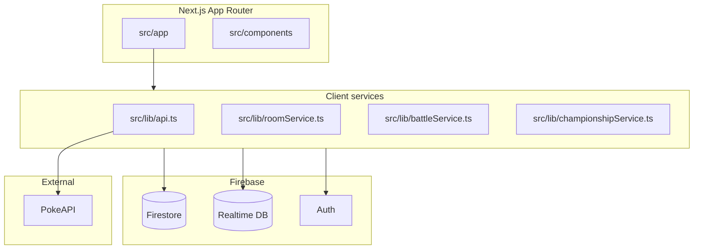

# Agent Guide — PokéDex & Battle Platform

Entry point for AI agents working in this repository. Read this first, then load domain skills from [`.cursor/skills/`](.cursor/skills/) as needed.

## Project summary

Next.js 15 App Router application: Pokédex, team builder, offline AI battles, real-time multiplayer battles (Firebase RTDB), championships, checklist, and competitive usage meta.

| Item | Detail |
|------|--------|
| **Stack** | TypeScript, Tailwind CSS, Firebase (Auth, Firestore, RTDB), PokeAPI |
| **Canonical prod URL** | `https://pokemon-indol-tau.vercel.app` |
| **Retired domain** | `pokemon.ultharcr.com` — do not use in new links or env defaults |
| **Maintainer map** | [docs/ARCHITECTURE_AND_HOSTING.md](docs/ARCHITECTURE_AND_HOSTING.md) |

## Quick start

```bash
npm install
npm run dev          # Next.js on port 3002 (not 3000)
npm run lint
npm run test:unit    # battle engine, RTDB service, bracket
```

Key env vars: see [`.env.example`](.env.example). Firebase features need `NEXT_PUBLIC_FIREBASE_*`; PokeAPI proxy needs Upstash + `NEXT_PUBLIC_POKEAPI_BASE_URL=/api/pokeapi`.

## Architecture



### Battle flows

```mermaid
flowchart TB
  subgraph offline [Offline AI Battle]
    BattlePage["/battle/page.tsx"]
    Runtime["/battle/runtime/page.tsx"]
    OfflineComp["OfflineBattleComponent"]
    OfflineHook["useOfflineBattleState"]
    Engine["team-battle-engine.ts"]
    BattlePage --> Runtime --> OfflineComp --> OfflineHook --> Engine
  end
  subgraph multiplayer [Multiplayer RTDB Battle]
    Lobby["/lobby/ roomService"]
    RTDBComp["RTDBBattleComponent"]
    BattleHook["useBattleState"]
    Submit["/api/battles/id/submit"]
    Resolution["battle-resolution.ts"]
    Lobby --> RTDBComp --> BattleHook
    BattleHook --> Submit --> Resolution
  end
```



### Domain map

| Domain | Primary code | Deep docs |
|--------|--------------|-----------|
| RTDB battles | `src/lib/firebase-rtdb-service.ts`, `RTDBBattleComponent.tsx` | [MULTIPLAYER_ARCHITECTURE.md](docs/MULTIPLAYER_ARCHITECTURE.md) |
| Offline battles | `OfflineBattleComponent.tsx`, `useOfflineBattleState.ts` | [battle_mechanics.md](docs/battle_mechanics.md) |
| Lobby / rooms | `src/lib/roomService.ts`, `src/app/lobby/` | [MULTIPLAYER_STATUS.md](docs/MULTIPLAYER_STATUS.md) |
| Championships | `championshipService.ts`, `src/app/championship/` | Firestore `championships` |
| Teams | `userTeams.ts`, `src/app/team/` | Firestore `userTeams` |
| Checklist | `src/lib/checklist/` | Local + Firestore sync |
| Pokédex / caching | `api.ts`, `ModernPokedexLayout.tsx` | [CACHING_ARCHITECTURE.md](docs/CACHING_ARCHITECTURE.md) |
| Usage / meta | `src/lib/usage/`, `/usage`, `/trends`, `/top50` | Ingest under `scripts/` |

## Critical gotchas

1. **Live battles use RTDB, not Firestore.** Firestore `battles` is legacy; real-time sync is `battles/{id}/` in RTDB.
2. **Multiplayer turn resolution is server-side only** via `battle-resolution.ts` and `/api/battles/[id]/submit`. Never resolve MP turns in the client.
3. **Offline vs multiplayer UI split:** `OfflineBattleComponent` vs `RTDBBattleComponent` — keep battle log / UI changes in sync (both use `battleLogToDisplayLines`).
4. **Dev port is 3002** — Playwright and `npm run dev` expect this.
5. **Two Firebase clients:** eager `firebase.ts` vs lazy `firebase/client.ts` — prefer lazy for lobby/checklist.
6. **Build ignores TS errors** (`typescript.ignoreBuildErrors: true`) — still fix types locally.
7. **ErrorTip "Gengar" mascot** is generic unknown-error UI, not the failing Pokémon.

## Where to work

| Path | Purpose |
|------|---------|
| `src/app/` | Routes, API routes, `*PageClient.tsx` for interactive pages |
| `src/components/` | Reusable UI; domain subdirs (`battle/`, `multiplayer/`, `championship/`) |
| `src/lib/` | Framework-agnostic logic, engines, services |
| `src/hooks/` | Custom hooks (`useBattleState`, `useOfflineBattleState`, etc.) |
| `src/contexts/` | `AuthContext`, `ErrorContext` |
| `src/types/` | Shared TypeScript types |
| `docs/` | Maintainer documentation — link, don't duplicate |

Conventions: [docs/coding_standards.md](docs/coding_standards.md). Use `@/` imports (`@/*` → `src/*`).

## Testing matrix

| Change area | Commands |
|-------------|----------|
| Battle engine / damage / mechanics | `npm run test:unit` + `npm run test:integration` |
| RTDB service / resolution | `npm run test:unit` + `npm run test:security` |
| RTDBBattleComponent | `npm run test:component` |
| Offline battle UI | `npx playwright test tests/playwright/offline-battle.spec.ts` |
| Lobby / multiplayer flow | `npm run test:e2e:multiplayer` |
| Bracket / championships | `npm run test:unit` (includes bracket tests) |
| Full CI parity | `npm run lint` + `npm run test:unit` + `npm run build` |

E2E dev server: Playwright auto-starts `npm run dev` on port 3002. See [`.cursor/skills/testing/workflows.md`](.cursor/skills/testing/workflows.md).

## Skills index

Load from `.cursor/skills/<name>/SKILL.md`:

| Skill | Use when |
|-------|----------|
| `battle-system` | Battle engine, turns, damage, offline AI, battle UI |
| `firebase-multiplayer` | Lobby, RTDB, Firestore, auth, security rules |
| `pokeapi-caching` | PokeAPI, caching, request cancellation, move data |
| `testing` | Vitest, Playwright, CI test failures |
| `vercel-deploy` | Deploy, env vars, production verification |
| `championships` | Tournaments, brackets, seeding |
| `checklist-dex` | Dex progress, caught/seen, cloud sync |
| `usage-meta` | Smogon usage, trends, top50, meta dashboards |
| `pokedex-ui` | Layouts, themes, search, performance, i18n |

## Rules index

Auto-applied Cursor rules in [`.cursor/rules/`](.cursor/rules/):

| Rule | Scope |
|------|-------|
| `project-core.mdc` | Always — imports, port, file placement |
| `typescript-react.mdc` | `**/*.{ts,tsx}` — typing, client boundaries |
| `battle-engine.mdc` | Battle engine files — server resolution, tests |
| `firebase-services.mdc` | Firebase / RTDB / room service files |

## Workflows

Runnable workflows in [`.cursor/workflows/`](.cursor/workflows/):

- `test-multiplayer-battle.md` — headed multiplayer Playwright test
- `dev-and-test-battle.md` — dev server + offline battle E2E

Legacy `.agent/workflows/` redirects here.
