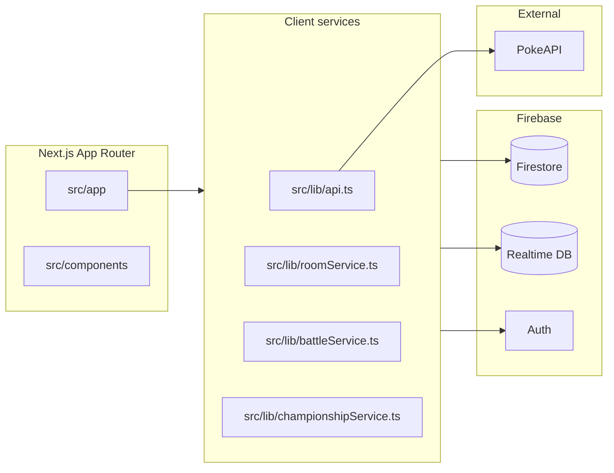

# Architecture & hosting (maintainer reference)

Single place to confirm **where the app runs**, how pieces fit together, and **which files own the hairy logic**. Update this doc when hosting URLs or major modules change.

## Hosting & production URL

| Item | Detail |
|------|--------|
| **Platform** | [Vercel](https://vercel.com) — build via `npm run build` (see [`vercel.json`](../vercel.json)). |
| **Known production app** | [https://pokemon-indol-tau.vercel.app](https://pokemon-indol-tau.vercel.app) — e.g. [Battle / AI battle](https://pokemon-indol-tau.vercel.app/battle/). |
| **Source of truth for “what is live”** | The Vercel project’s **Deployments** tab: successful deployment + **Git commit** = what users get. Custom domains point at the same project. |

Local `main` (or your branch) is **not** live until CI/CD or a manual Vercel deploy finishes for that commit.

## High-level architecture

- **UI**: `src/app/**` (routes), `src/components/**`.
- **Pokémon data**: PokeAPI through [`src/lib/api.ts`](../src/lib/api.ts) plus caching layers (see [CACHING_ARCHITECTURE.md](./CACHING_ARCHITECTURE.md)).
- **Auth + cloud persistence**: Firebase Auth; Firestore for saved teams, championships, dex progress, etc.
- **Live battles**: Firebase **Realtime Database** for match state and sync (not Firestore). See multiplayer docs below.

## Complex modules — map

Use this table when debugging or extending features; follow links for full write-ups.

| Domain | Primary code | Notes / deep docs |
|--------|----------------|-------------------|
| **RTDB battles** | [`src/lib/firebase-rtdb-service.ts`](../src/lib/firebase-rtdb-service.ts), [`src/lib/battleService.ts`](../src/lib/battleService.ts), `src/components/**/RTDB*` | [MULTIPLAYER_ARCHITECTURE.md](./MULTIPLAYER_ARCHITECTURE.md), [battle_mechanics.md](./battle_mechanics.md), [QUICK_START_MULTIPLAYER.md](./QUICK_START_MULTIPLAYER.md) |
| **Battle rooms / lobby** | [`src/lib/roomService.ts`](../src/lib/roomService.ts), `src/app/lobby/` | [MULTIPLAYER_STATUS.md](./MULTIPLAYER_STATUS.md) |
| **Championships** | [`src/lib/championshipService.ts`](../src/lib/championshipService.ts), [`src/lib/championship/bracket.ts`](../src/lib/championship/bracket.ts), `src/app/championship/` | Firestore `championships`; bracket generation + seeding in `bracket.ts`. Optional **generation cap**: [`src/lib/pokemon/nationalDexByGeneration.ts`](../src/lib/pokemon/nationalDexByGeneration.ts) (National Dex through Gen *N*). |
| **Teams** | [`src/lib/userTeams.ts`](../src/lib/userTeams.ts), `src/app/team/` | Firestore `userTeams`; slots hold national dex `id`, moves, nature. |
| **Caching & requests** | [`src/lib/api.ts`](../src/lib/api.ts), [`src/lib/memcached`](../src/lib/memcached), [REQUEST_MANAGEMENT_GUIDE.md](./REQUEST_MANAGEMENT_GUIDE.md) | [CACHING_ARCHITECTURE.md](./CACHING_ARCHITECTURE.md) |
| **Pokédex UI / perf** | [`src/components/ModernPokedexLayout.tsx`](../src/components/ModernPokedexLayout.tsx) | [POKEDEX_PERFORMANCE_QUICK_START.md](./POKEDEX_PERFORMANCE_QUICK_START.md), [POKEDEX_PERFORMANCE_OPTIMIZATIONS.md](./POKEDEX_PERFORMANCE_OPTIMIZATIONS.md) |
| **Usage / meta** | `src/lib/usage/`, trends UI | Ingest scripts under `src/lib/usage/` |

## How to validate production vs local

1. Open the **production** base URL (above) or your production custom domain.
2. Hit the feature you care about (e.g. `/championship`, `/battle`, `/lobby/...`).
3. In **Vercel → Deployments**, confirm the latest **Ready** deployment matches the **commit** you expect (`git log -1 --oneline` locally).

## Related repo docs

- [coding_standards.md](./coding_standards.md)
- [CACHE_SUMMARY.md](./CACHE_SUMMARY.md) / [CACHE_VERIFICATION_GUIDE.md](./CACHE_VERIFICATION_GUIDE.md)
- [TODO.md](./TODO.md) (if used for roadmap)
